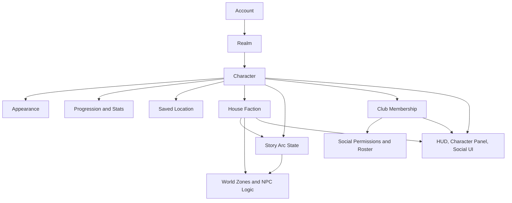
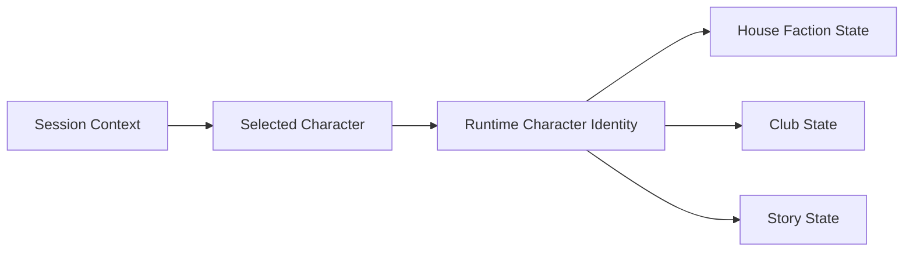
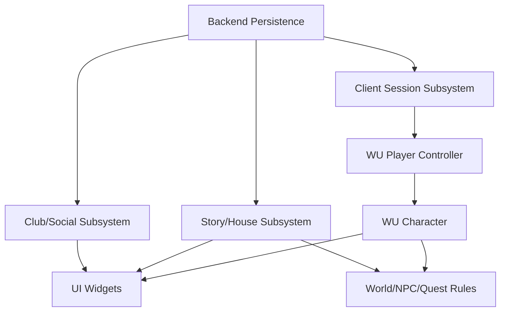
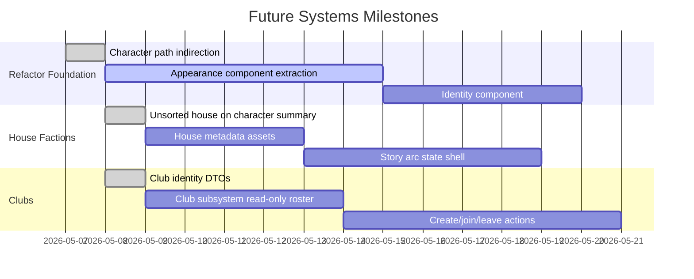

# WU Future Systems Pathing Plan

Last updated: 2026-05-08

## Purpose

This document captures the longer-term system direction while the current C++ refactor is still underway.

Two future identity systems need to be protected in the architecture:

- `Clubs`: the player social system and stand-in for guilds.
- `House Factions`: in-world identity groups that shape character flavor, story arc routing, reputation, and presentation.

The main rule: Clubs and House Factions should not be bolted directly into `AWUCharacter` or `AWUPlayerController`. They should become separate identity/social/story systems that the character, UI, backend client, and world systems can read from.

## High-Level Shape



## Identity Layers



`Session Context` is account, realm, auth token, selected character, and cached backend summaries.

`Runtime Character Identity` is the bridge between backend data and the possessed pawn. It should eventually include character id, display name, house faction, club membership, title, portrait, and other identity details.

`House State` belongs to the character. It should be stable and story-facing.

`Club State` belongs to the character/account relationship inside a realm. It should be social-facing and mutable.

## Clubs

Clubs are the guild replacement. They should answer: who are my people, what can we coordinate, and what social privileges do we share?

Recommended model:

- Club id
- Realm id
- Name
- Tag or short name
- Description
- Owner character id
- Member roster
- Member rank
- Invite state
- Club permissions
- Created timestamp

Suggested ranks:

- President
- Officer
- Member
- Recruit

President is the controlling rank. Club permissions should be configurable by rank instead of hardcoded only by rank name.

Permission buckets to support:

- Invite recruits
- Uninvite pending invites
- Kick members
- Promote members
- Demote members
- Edit public notes
- Edit officer notes
- Manage club preferences

Club member data should support:

- Character name
- Online state
- Location
- Level
- Path
- Last online display, such as `Now` or `3 days`
- Public note
- Officer note

Club social tab behavior:

- Show online members by default.
- Toggle offline members on demand.
- Include a quick invite button.
- Later, housing can attach ownership or permissions to `clubId`.

Chat routing:

- `/c` sends to club chat.
- `/o` sends to officer chat.
- Officer chat requires the speaker to have an officer-capable rank or permission.

Early feature path:

1. Read-only club membership on the character summary.
2. Character panel shows club name/tag.
3. Add club roster DTOs to backend client.
4. Add create/join/leave flows.
5. Add invite and rank management.
6. Add club chat channel.
7. Add club bank/storage only after inventory is split cleanly.

Do not put club roster logic inside `AWUCharacter`. The pawn can display the club identity, but roster, invite, rank, and permissions should live in a client social subsystem and backend service.

## House Factions

House Factions are not guilds. They are in-world identity and story routing.

They should answer: what narrative lane is this character in, what flavor does the world reflect back at them, and what reputation or story flags are unlocked?

Recommended model:

- House faction id
- Display name
- Short name
- Motto or theme text
- Primary colors
- Icon or crest asset
- Starter reputation
- Story arc family
- Gameplay tags
- NPC attitude modifiers

Per-character state:

- Assigned house faction id, defaulting to `Unsorted`
- House reputation
- House story chapter
- House story flags
- Rival/friendly faction values

Early feature path:

1. Add a simple `EWUHouseFaction` or `FName HouseFactionId` to character creation/backend summaries.
2. Display house on character select and character panel.
3. Use data assets for house metadata: color, crest, display text, and story arc id.
4. Add story flags separately from stats and inventory.
5. Let zone/NPC/story systems query house/story state by character id.
6. Add house-specific dialogue, quest availability, flavor barks, and reputation gates.

House should usually be harder to change than Club. Club is social and mutable. House is character identity and narrative weight.

Current intended house lifecycle:

1. New/login characters are `Unsorted`.
2. `Unsorted` is treated like a fifth house status in UI and backend identity.
3. At level 10 or 11, the character reaches the Great Hall sorting moment.
4. Sorting permanently changes that character to one of the four houses.
5. There is no normal house-swap feature after sorting.

House buff source images currently live outside the Unreal project at:

```text
C:/Users/raven/Documents/Personal Projects/Wizards/images/House Buffs/
```

Known files:

- `GriffindorBuff.png`
- `HufflepuffBuff.png`
- `RavenclawBuff.png`
- `SlytherinBuff.png`

When importing them into Unreal, keep the raw source files outside vendor asset packs and import the resulting assets under a game-owned UI path such as:

```text
/Game/UI/Icons/HouseBuffs/
```

## Data Ownership



Short-term, `UWUClientSessionSubsystem` can keep carrying the backend DTOs because that is how the project works today.

Long-term, split it this way:

- `UWUSessionStateSubsystem`: auth, account, realm, selected character.
- `UWUBackendClient`: request construction, response parsing, endpoint wrappers.
- `UWUClubSubsystem`: club cache, roster, invites, rank actions.
- `UWUHouseFactionSubsystem`: house metadata, story arc metadata, client-side cached story state.
- `UWUCharacterIdentityComponent`: runtime identity on the pawn, replicated enough for nameplates/HUD.

## Backend Shape

Character summaries should eventually include lightweight identity references:

```json
{
  "characterId": "character_123",
  "name": "Example",
  "race": "Halfblood",
  "sex": "Female",
  "house": "Unsorted",
  "club": {
    "clubId": "club_123",
    "name": "Moonlit Table",
    "tag": "MOON",
    "rank": "Member"
  }
}
```

Full club rosters and full story state should be separate calls. Do not overload the character list with every club member and every story flag.

Database foundation added in:

```text
Server/db/init/003_clubs.sql
```

Initial tables:

- `clubs`: realm-scoped club identity, tag, description, president pointer, active/disbanded state.
- `club_rank_permissions`: president-configurable rank permission masks.
- `club_members`: one active club membership per character, rank, public note, officer note.
- `club_invites`: pending/accepted/declined/revoked/expired invites.
- `character_presence`: online state, current zone, path, and last-online source for social tabs.
- `club_chat_messages`: `/c` club chat and `/o` officer chat persistence/history.

Possible endpoint families:

```text
/api/accounts/{accountId}/realms/{realmId}/characters
/api/characters/{characterId}/identity
/api/characters/{characterId}/house
/api/characters/{characterId}/story-state
/api/clubs
/api/clubs/{clubId}
/api/clubs/{clubId}/members
/api/clubs/{clubId}/invites
```

## C++ Refactor Path

Do this after the current character/controller split has started, but before social features get large.

1. Character identity types
   - Add lightweight structs for club summary and house faction id.
   - Extend backend character summary.
   - Keep default values safe for existing characters.

2. Runtime identity component
   - Create `UWUCharacterIdentityComponent`.
   - Move display name, portrait, backend character id, house faction id, and club summary toward it.
   - Leave forwarding helpers on `AWUCharacter` during transition.

3. Club subsystem
   - Add client cache and request functions.
   - Start with read-only membership and roster.
   - Add mutations after UI is ready.

4. House faction data
   - Add house faction data assets or a simple data table.
   - Connect house id to display name, colors, crest, and story arc key.
   - Keep story progression separate from visual metadata.

5. UI wiring
   - Character select: show house and club summary.
   - Character panel: show house identity and club membership.
   - Social panel: club roster, invites, ranks.
   - Story panel later: house story chapter and reputation.

6. World/story integration
   - World systems query identity/story systems.
   - NPCs and quests should not parse raw backend JSON or ask the session subsystem directly.

## Implementation Guardrails

- Club is social membership. House is story identity. Keep them separate.
- Club can change. House should be stable unless a story event explicitly changes it.
- Backend owns persistence. Runtime components own replicated gameplay-facing identity.
- UI reads summaries and subscribes to change events; UI should not own truth.
- `AWUCharacter` can expose convenience getters, but it should not become the home of Club or House logic.
- `AWUPlayerController` can request panels/actions, but it should not own rosters, story flags, or faction rules.

## Suggested Milestones



The dates are placeholders for ordering, not commitments. The dependency order matters more than the calendar.

## Near-Term Reminder

When adding either system, start with read-only identity first:

```text
Backend summary -> session cache -> runtime identity -> UI display
```

Only after that path is stable should we add mutation flows like join club, leave club, change rank, alter house reputation, or unlock story arc state.
